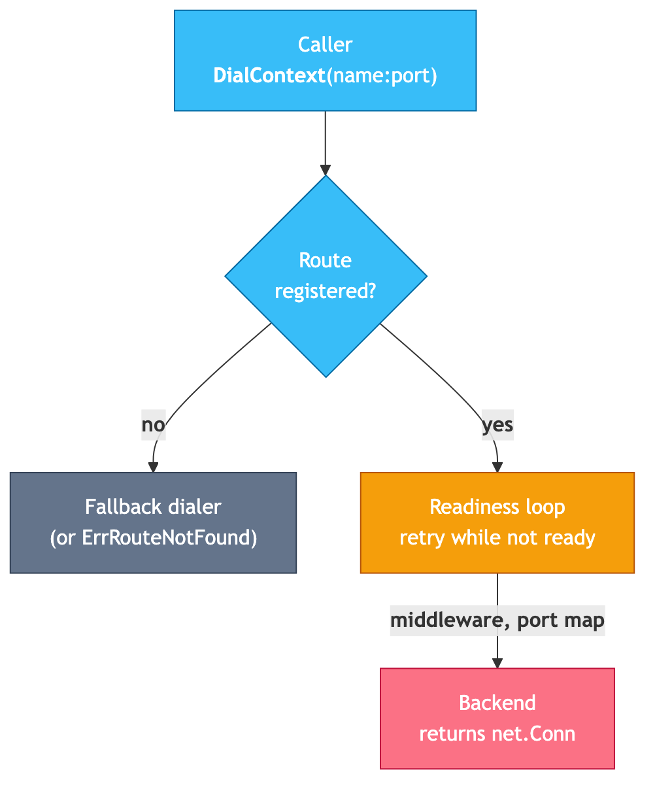

# go-portless

[](https://pkg.go.dev/github.com/sanketsudake/go-portless)
[](https://github.com/sanketsudake/go-portless/actions/workflows/ci.yml)
[](https://github.com/sanketsudake/go-portless/actions/workflows/codeql.yml)
[](LICENSE)
[](go.mod)

Dial services by name in Go tests and CI — with readiness built into the dial.

Register a name and dial it instead of hardcoding `127.0.0.1:8888` or racing to find a free port.
The dial blocks until the backend accepts, so a test dials a service that is still starting instead of polling for it, and backends self-heal across restarts.
Ports leave your vocabulary: the port-free backends never surface one.

Inspired by [portless.sh](https://portless.sh), rebuilt for test infrastructure: zero-root, no `/etc/hosts`, no daemon required for in-process use.

## Quickstart

Run a process on an assigned port and reach it by name — no port picked:

```sh
go install github.com/sanketsudake/go-portless/cmd/portless@latest

portless run web -- go run ./cmd/server   # binds $PORT, names it "web"
eval "$(portless env)"                    # export HTTP_PROXY / NO_PROXY
curl http://web/healthz                   # blocks until "web" is serving
```

From Go, point any `http.Client`, gRPC, or websocket dialer at the registry:

```go
reg := portless.New()
defer reg.Close()
reg.Add(ctx, "web", backend.Future())      // OS assigns the port later
// … start your server on net.Listen(":0"), then f.SetListener(l) …
resp, err := reg.HTTPClient().Get("http://web/healthz")
```

Runnable examples and the full API are on [pkg.go.dev](https://pkg.go.dev/github.com/sanketsudake/go-portless).

## How it works



`Registry.DialContext` has the same shape as `net.Dialer.DialContext`, so HTTP, WebSockets, gRPC, and raw TCP all route through one path.

WebSockets, both major libraries — with gorilla/websocket, inject the dialer:

```go
d := websocket.Dialer{NetDialContext: reg.DialContext}
conn, _, err := d.Dial(portless.WSURL("web", 0, "/stream"), nil)
```

coder/websocket has no dialer hook; inject the HTTP client instead:

```go
conn, _, err := websocket.Dial(ctx, portless.WSURL("web", 0, "/stream"),
    &websocket.DialOptions{HTTPClient: reg.DefaultClient()})
```

The coder/websocket path works because Go's HTTP/1.1 101-upgrade response bodies are writable through a custom transport.

## Backends

| Backend | Port | Use for |
|---------|------|---------|
| `backend.Future` | OS-assigned, supplied later | a server you start in the test |
| `backend.Listener` | OS-assigned (`l.Addr()`) | an already-bound `net.Listener` |
| `backend.Mem` | none (`net.Pipe`) | serve HTTP with zero TCP sockets |
| `k8s.PortForward` | none (pod stream) | a Kubernetes Service or pod |
| `backend.TCP` / `portless alias` | you supply it | escape hatch: name an already-running address |

## Servers with DNS-rebinding protection

Some servers reject requests that arrive on a loopback connection with a non-loopback `Host` — exactly what name-based dialing over a port-forward produces — and answer 403.
Register the route with a Host rewrite so the server sees a loopback name:

```go
reg.Add(ctx, "api", b, portless.RouteWithHostRewrite("127.0.0.1"))
```

See [writing-backends](docs/writing-backends.md#servers-with-dns-rebinding-protection) for the symptom and both fixes.

## HTTPS

`portless serve --tls` terminates TLS so `https://<name>` verifies against a local CA:

```sh
portless serve --tls &
portless ca install        # trust the CA once (asks first)
curl https://web/healthz
```

## Docs

- [API reference (godoc)](https://pkg.go.dev/github.com/sanketsudake/go-portless) — types, examples
- [CLI reference](docs/cli.md) — every command and flag
- [Architecture](docs/architecture.md) — the dial model, proxy, k8s backend, threat model
- [Writing backends](docs/writing-backends.md) — custom backends and middleware

## Modules

| Module | Path | Depends on |
|--------|------|------------|
| core | `github.com/sanketsudake/go-portless` | stdlib only |
| k8s backend | `github.com/sanketsudake/go-portless/k8s` | core + client-go |
| CLI | `github.com/sanketsudake/go-portless/cmd/portless` | core + k8s |

## Motivation

go-portless grew out of the [fission](https://github.com/fission/fission) test suite — `FindFreePort` races, hardcoded addresses, self-healing `kubectl port-forward` loops, `ws://` rewriting — but none of that is fission-specific.
Any Go project whose tests reach real services hits it.

## License

Apache License 2.0 — see [LICENSE](LICENSE) and [NOTICE](NOTICE).
