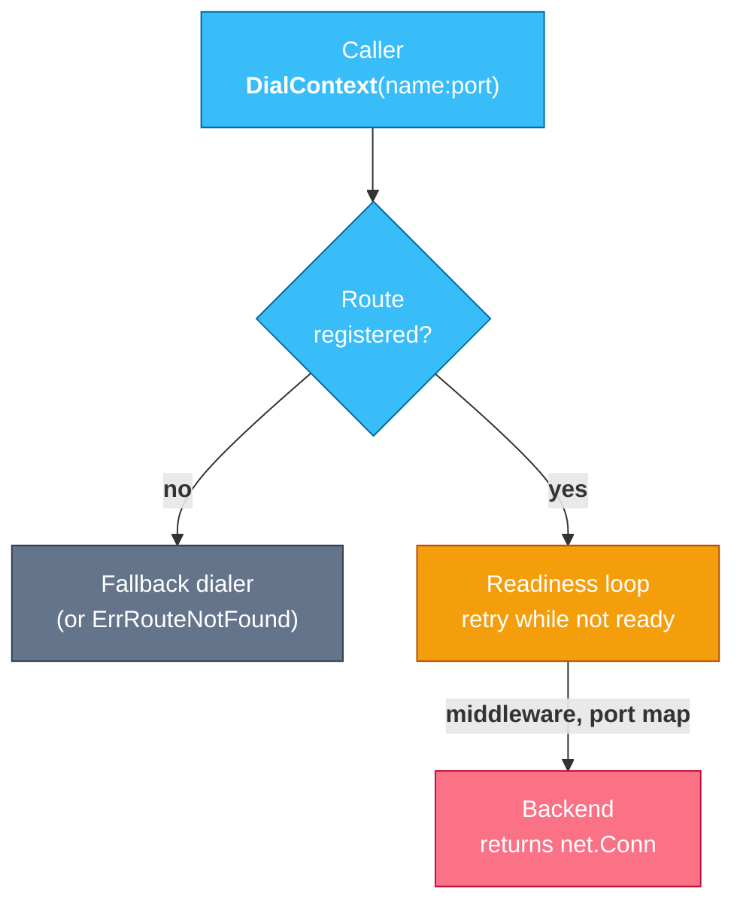
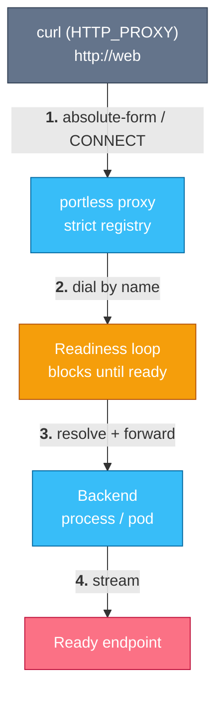

# go-portless

Dial services by name in Go tests and CI — with readiness built into the dial.

Instead of hardcoding `127.0.0.1:8888`, racing to find a free port, or babysitting `kubectl port-forward` reconnect loops, you register a name and dial it.
The dial blocks — bounded by the context and a ready timeout — until the backend actually accepts a connection, so a test dials a service that is still starting instead of polling for it.
Backends self-heal across restarts.

Ports drop out of your vocabulary because the backends never surface one: an OS-assigned listener, an in-memory pipe, or a Kubernetes pod.
You never pick, hardcode, or race for a port number.

Inspired by [portless.sh](https://portless.sh), rebuilt for test infrastructure: zero-root, no `/etc/hosts`, no TLS CA, no daemon required for in-process use.

## Quickstart

**CLI** — run any process on an assigned port and reach it by name, like `portless.sh`:

```sh
portless run web -- go run ./cmd/server   # binds $PORT, registers "web"
eval "$(portless env)"                    # export HTTP_PROXY / HTTPS_PROXY / NO_PROXY
curl http://web/healthz                   # blocks until "web" is serving
```

`run` never makes you choose a port: it assigns a free one, passes it to the child as `$PORT`, and gives the process a stable name.
It auto-starts a shared background daemon, so several `run`s share one proxy.

**Library** — three lines against any service:

```go
reg := portless.New()
defer reg.Close()

f := backend.Future()            // address supplied once the server is up
reg.Add(ctx, "web", f)

l, _ := net.Listen("tcp", ":0")  // the OS assigns the port — no FindFreePort, no race
go serve(l)
f.SetListener(l)                 // dials to "web" now succeed

resp, err := reg.HTTPClient().Get("http://web/healthz")
```

The dial to `web` blocks until the backend accepts, so tests need no `Eventually` wrappers just to survive startup races.

## Install

```sh
go get github.com/sanketsudake/go-portless
```

The core module depends only on the standard library.
The Kubernetes port-forward backend lives in a separate module (`github.com/sanketsudake/go-portless/k8s`) so client-go never enters non-k8s builds.

## How a dial resolves



`Registry.DialContext` has the same shape as `net.Dialer.DialContext`, so it drops into `http.Transport`, `grpc.WithContextDialer`, and `websocket.Dialer.NetDialContext`.
Names resolve at the L4 dial layer, so HTTP, WebSockets, gRPC, and raw TCP all work through one path — no rewriting `http://` into `ws://` by hand.

## Backends

A backend maps a name to a live connection.
The port-free backends are the point:

| Backend | Port | Use for |
|---------|------|---------|
| `backend.Future` | OS-assigned, supplied later | a server you start in the test |
| `backend.Listener` | OS-assigned (`l.Addr()`) | an already-bound `net.Listener` |
| `backend.Mem` | none (`net.Pipe`) | serve HTTP with zero TCP sockets |
| `k8s.PortForward` | none (pod stream) | a Kubernetes Service or pod |
| `backend.TCP` | you supply it | **escape hatch**: name an already-running address |

`backend.TCP("127.0.0.1:9000")` (and the CLI's `portless alias`) is name-aliasing, not port elimination — it points a name at something already listening, like `portless.sh`'s `alias`.
Reach for it to bridge to a container or external service; reach for the others to actually drop ports.

### WebSockets and gRPC

```go
// WebSocket — no http→ws string surgery.
d := websocket.Dialer{NetDialContext: reg.DialContext}
conn, _, err := d.Dial(portless.WSURL("web", 0, "/stream"), nil)

// gRPC
cc, err := grpc.NewClient("web:80", grpc.WithContextDialer(reg.DialContext))
```

### Extensibility

Middleware wraps the dial path (registry-wide or per-route) — the seam for fault injection, latency, and traffic metrics without changing the core:

```go
reg := portless.New(portless.WithMiddleware(
    portless.ConnWrapper(func(name string, c net.Conn) net.Conn {
        return meteredConn(name, c) // count bytes, log, inject latency…
    }),
))
```

Route lifecycle and dial events (`EventDialRetry`, `EventBackendUnhealthy`, …) are delivered to handlers registered with `WithEventHandler`.
See [docs/writing-backends.md](docs/writing-backends.md) for custom backends and middleware.

## Kubernetes backend

The `k8s` module forwards each dial as its own SPDY stream to a ready pod — no local listener, no reconnect loop.
Pod restarts self-heal: the next dial re-resolves a ready pod, and the readiness loop absorbs the gap.

```go
b, _ := k8s.PortForward(restConfig, k8s.Service("default", "web"))
reg.Add(ctx, "web", b)
```

## CLI and the forward proxy

For shell scripts, CI, and non-Go processes, the daemon exposes named routes via `HTTP_PROXY`:

```sh
portless run web -- go run ./cmd/server      # run a process on an assigned port
portless alias db 127.0.0.1:5432             # name an already-running service
portless route add api --k8s-service prod/api  # forward to a Kubernetes Service
portless doctor                              # wait once until routes are ready
eval "$(portless env)"                       # export the proxy for this shell
curl http://web/healthz
```

A request from curl reaches the backend through the same readiness-aware dial the library uses:



The daemon fronts the proxy with a strict registry, so it only reaches registered routes — never a fallback network dial.
In GitHub Actions, `portless env --shell github >> "$GITHUB_ENV"` exports the proxy for the whole job.

## Modules

| Module | Path | Depends on |
|--------|------|------------|
| core | `github.com/sanketsudake/go-portless` | stdlib only |
| k8s backend | `github.com/sanketsudake/go-portless/k8s` | core + client-go |
| CLI | `github.com/sanketsudake/go-portless/cmd/portless` | core + k8s |

During development the sub-modules resolve the core via a `replace` directive; these are removed and pinned to a tagged version at release.

## Motivation

go-portless grew out of the [fission](https://github.com/fission/fission) test suite, where the same friction shows up everywhere: `FindFreePort` races, hardcoded `127.0.0.1:8888` addresses that must match a CI port-forward, self-healing `kubectl port-forward` bash loops, and `ws://` URLs hand-rewritten from `http://`.
None of that is fission-specific — any Go project whose tests reach real services hits it — so the library is general-purpose, with fission as the first consumer.
See [docs/architecture.md](docs/architecture.md) for the design.

## License

Apache License 2.0 — see [LICENSE](LICENSE) and [NOTICE](NOTICE).
